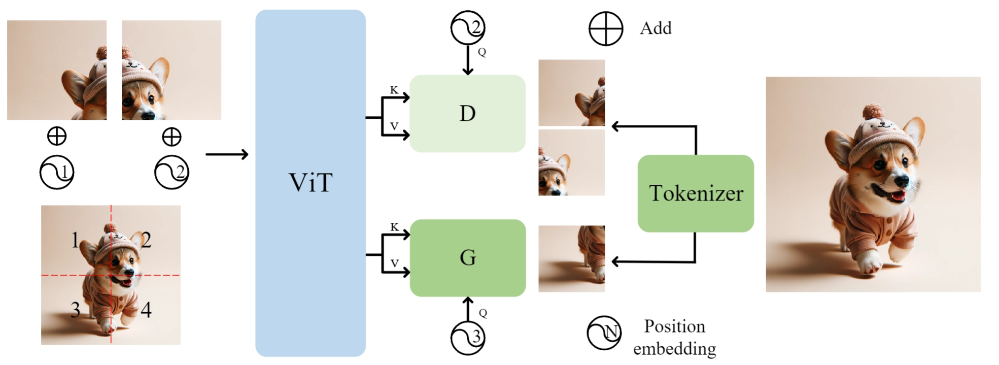

# D-iGPT

This repository is the official implementation of our  [**Rejuvenating image-GPT as Strong Visual Representation Learners**](https://arxiv.org/abs/2312.02147)

  

## Introduction
> This paper enhances image-GPT (iGPT), one of the pioneering works that introduce autoregressive pretraining to predict next pixels for visual representation learning.  Two simple yet essential changes are made. First, we shift the prediction target from raw pixels to semantic tokens,  enabling a higher-level understanding of visual content. Second, we supplement the autoregressive modeling by instructing the model to predict not only the next tokens but also the visible tokens. This pipeline is particularly effective when semantic tokens are encoded by discriminatively trained models, such as CLIP. We introduce this novel approach as D-iGPT. Extensive experiments showcase that D-iGPT excels as a strong learner of visual representations: A notable achievement of D-iGPT is its compelling performance on the ImageNet-1K dataset --- by training on publicly available datasets, D-iGPT achieves 89.5\% top-1 accuracy with a vanilla ViT-Large model. This model also shows strong generalization on the downstream task and robustness on out-of-distribution samples.

## Model Training
We train our base size D-iGPT on torch+GPU and large size D-iGPT on torch_xla+TPU. Please refer [D-iGPT](https://github.com/OliverRensu/D-iGPT/tree/main/DiGPT_torch) and [D-iGPT_torchxla (coming soon)](./torch_xla) resplectively.

## Performance
Performance comparison on ImageNet-1K classification and ADE20K Semantic Segmentation. 
|Method|Model Size| Top-1 | mIoU|
|---|:---:|:---:|:---:|
|MAE|ViT-B| 83.6| 48.1|
|RandSac|ViT-B| 83.7| -|
|EVA|ViT-B| 85.5| 53.3|
|D-iGPT|ViT-B| 86.2 | 53.8|

The torch+GPU code produces better results. This is likely caused by the system difference between torch+GPU and torchxla+TPU.
<table><tbody>
<!-- START TABLE -->
<!-- TABLE HEADER -->
<th valign="bottom"></th>
<th valign="bottom">ViT-Base</th>
<!-- TABLE BODY -->
<tr><td align="left">torch+GPU</td>
<td align="center">86.2</td>
</tr>
<tr><td align="left">torchxla+TPU</td>
<td align="center">85.9</td>
</tr>
</tbody></table>

Performance comparison on ImageNet-1K classification with IN-21K as training data (if avaiable). 
|Method|Model Size| Top-1 | 
|---|:---:|:---:|
|MAE|ViT-L| 85.9| 
|BEiT|ViT-L| 88.6|
|D-iGPT|ViT-L| 89.5|

## Checkpoint
The pretrained models are available at [[Google Drive](https://drive.google.com/drive/folders/1fO6QL_4g50d4a4cZ0UUIccfKicVWrguY?usp=sharing)]

## Acknowledgement

We are  very grateful that this work is supported by TPU Research Cloud (TRC) program and Google Cloud Research Credits program.

## ✍ Citation

If you have any question, feel free to contact [Sucheng Ren](https://oliverrensu.github.io/) :)
